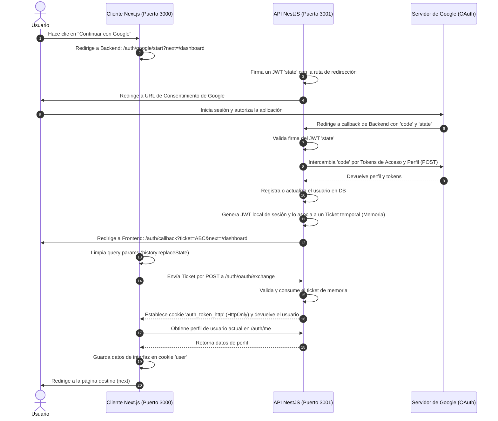

# Documentación de Inicio de Sesión con Google (Google OAuth)

Esta documentación describe la arquitectura, el flujo de datos y los detalles de implementación del inicio de sesión único con Google en esta aplicación. Está estructurada de forma modular para que otro agente de IA o desarrollador pueda leerla e implementar este mismo sistema seguro en un nuevo proyecto.

---

## 1. Arquitectura y Flujo de Autenticación

El sistema implementa un flujo híbrido seguro que combina **OAuth 2.0 (Redirect Flow)**, un **intercambio temporal de tickets (Session Ticket Exchange)** y **cookies HttpOnly** para el almacenamiento seguro de la sesión, evitando exponer tokens JWT en la URL del navegador.



### Ventajas de Seguridad de este Flujo
1. **Protección contra CSRF**: El parámetro `state` enviado a Google es un JWT firmado por el backend con expiración corta (10 minutos), impidiendo ataques de fijación de sesión.
2. **Sin Tokens en la URL**: En lugar de enviar el JWT de sesión en la redirección de regreso al frontend, se envía un `ticket` aleatorio de un solo uso que expira en 2 minutos.
3. **Almacenamiento Seguro (HttpOnly)**: El JWT real que mantiene la sesión se guarda en una cookie con la bandera `HttpOnly`, lo que impide el acceso a ella desde scripts de JavaScript (previniendo ataques XSS).
4. **CORS Controlado**: El frontend utiliza `credentials: 'include'` en sus peticiones fetch para enviar las cookies al backend de forma automática.

---

## 2. Requisitos de Base de Datos (Prisma)

El modelo central para la autenticación es `Account`. A continuación se presenta el fragmento relevante del esquema de Prisma (`schema.prisma`):

```prisma
model Account {
  id              String   @id @default(uuid())
  email           String   @unique
  password        String?  // Opcional, nulo para usuarios de Google
  googleSub       String?  @unique @map("google_sub") // ID de Google
  googleEmail     String?  @map("google_email")
  googleAvatarUrl String?  @map("google_avatar_url")
  authProvider    String   @default("credentials") @map("auth_provider") // "google" o "credentials"

  role            UserRole      @default(NUTRITIONIST)
  status          AccountStatus @default(PENDING)
  createdAt       DateTime      @default(now()) @map("created_at")
  updatedAt       DateTime      @updatedAt @map("updated_at")
  lastLoginAt     DateTime?     @map("last_login_at") @db.Timestamptz(6)

  // Relaciones específicas del negocio
  nutritionist    Nutritionist?
  
  @@map("accounts")
}

enum UserRole {
  ADMIN
  NUTRITIONIST
  NUTRITIONIST_DEVELOPER
  ADMIN_MASTER
  ADMIN_GENERAL
  WORKER
}

enum AccountStatus {
  ACTIVE
  SUSPENDED
  PENDING
  DELETED
}
```

---

## 3. Configuración del Backend (NestJS)

### Variables de Entorno Requeridas (`.env` del Backend)
```bash
PORT=3001
FRONTEND_URL=http://localhost:3000
JWT_SECRET=tu_jwt_secret_super_seguro
GOOGLE_CLIENT_ID=tu_google_client_id.apps.googleusercontent.com
GOOGLE_CLIENT_SECRET=tu_google_client_secret
GOOGLE_AUTH_REDIRECT_URI=http://localhost:3001/auth/google/callback
```

### Configuración del Servidor y CORS (`main.ts`)
El backend debe habilitar CORS permitiendo el envío de credenciales (`credentials: true`) desde los orígenes del frontend:

```typescript
const frontendOrigins = new Set(
  [
    process.env.FRONTEND_URL,
    process.env.NEXT_PUBLIC_FRONTEND_URL,
    'http://localhost:3000',
  ]
    .filter(Boolean)
    .map((origin) => origin!.replace(/\/$/, '')),
);

app.enableCors({
  origin: (origin: string | undefined, callback: (error: Error | null, allow?: boolean) => void) => {
    if (!origin || frontendOrigins.has(origin.replace(/\/$/, ''))) {
      return callback(null, true);
    }
    return callback(new Error('CORS blocked'));
  },
  credentials: true,
});
```

---

## 4. Código del Backend

### A. Módulo de Integración con Google (`google-integration.service.ts`)
Este servicio encapsula la lógica para interactuar con las APIs de Google y manejar el protocolo OAuth2.

```typescript
import { Injectable, BadRequestException } from '@nestjs/common';
import { ConfigService } from '@nestjs/config';
import * as jwt from 'jsonwebtoken';

type GoogleState = {
  mode: 'login';
  next?: string;
};

type GoogleProfile = {
  sub: string;
  email: string;
  email_verified: boolean;
  name?: string;
  picture?: string;
};

type GoogleTokenPayload = {
  access_token: string;
  refresh_token?: string;
  expires_in?: number;
};

const GOOGLE_AUTH_BASE = 'https://accounts.google.com/o/oauth2/v2/auth';
const GOOGLE_TOKEN_URL = 'https://oauth2.googleapis.com/token';
const GOOGLE_USERINFO_URL = 'https://openidconnect.googleapis.com/v1/userinfo';

@Injectable()
export class GoogleIntegrationService {
  constructor(private readonly configService: ConfigService) {}

  private getAppSecret() {
    return this.configService.getOrThrow<string>('JWT_SECRET');
  }

  private getGoogleClientId() {
    return this.configService.getOrThrow<string>('GOOGLE_CLIENT_ID');
  }

  private getGoogleClientSecret() {
    return this.configService.getOrThrow<string>('GOOGLE_CLIENT_SECRET');
  }

  private getGoogleAuthRedirectUri() {
    return this.configService.getOrThrow<string>('GOOGLE_AUTH_REDIRECT_URI');
  }

  private signState(state: GoogleState) {
    return jwt.sign(state, this.getAppSecret(), { expiresIn: '10m' });
  }

  private verifyState(token: string) {
    try {
      return jwt.verify(token, this.getAppSecret()) as GoogleState;
    } catch {
      throw new BadRequestException('Estado de autenticación expirado o inválido');
    }
  }

  // Genera la URL de redirección hacia Google
  async buildGoogleLoginUrl(next = '/dashboard') {
    const state: GoogleState = { mode: 'login', next };
    const query = new URLSearchParams({
      client_id: this.getGoogleClientId(),
      redirect_uri: this.getGoogleAuthRedirectUri(),
      response_type: 'code',
      scope: ['openid', 'email', 'profile'].join(' '),
      access_type: 'offline',
      prompt: 'consent',
      state: this.signState(state),
    });

    return `${GOOGLE_AUTH_BASE}?${query.toString()}`;
  }

  // Intercambia el código temporal de Google por el perfil del usuario
  async exchangeCodeForProfile(code: string, redirectUri: string) {
    const tokenResponse = await fetch(GOOGLE_TOKEN_URL, {
      method: 'POST',
      headers: { 'Content-Type': 'application/x-www-form-urlencoded' },
      body: new URLSearchParams({
        code,
        client_id: this.getGoogleClientId(),
        client_secret: this.getGoogleClientSecret(),
        redirect_uri: redirectUri,
        grant_type: 'authorization_code',
      }).toString(),
    });

    if (!tokenResponse.ok) {
      throw new BadRequestException('No se pudo completar la autenticación con Google');
    }

    const tokens = (await tokenResponse.json()) as GoogleTokenPayload;
    if (!tokens.access_token) {
      throw new BadRequestException('Google no devolvió un access token válido');
    }

    const profileResponse = await fetch(GOOGLE_USERINFO_URL, {
      headers: { Authorization: `Bearer ${tokens.access_token}` },
    });

    if (!profileResponse.ok) {
      throw new BadRequestException('No se pudo leer el perfil de Google');
    }

    const profile = (await profileResponse.json()) as GoogleProfile;
    if (!profile.email || !profile.email_verified) {
      throw new BadRequestException('Google no devolvió un correo verificado');
    }

    return { profile, tokens };
  }

  // Procesa la redirección entrante de Google
  async handleGoogleLoginCallback(code: string, stateToken: string) {
    const state = this.verifyState(stateToken);
    if (state.mode !== 'login') {
      throw new BadRequestException('Estado de autenticación inválido');
    }

    const result = await this.exchangeCodeForProfile(code, this.getGoogleAuthRedirectUri());

    return {
      next: state.next || '/dashboard',
      profile: result.profile,
      tokens: result.tokens,
    };
  }
}
```

### B. Servicio de Autenticación (`auth.service.ts`)
Administra la creación y consumo de tickets de sesión en memoria, y el inicio de sesión / registro automático del usuario de Google.

```typescript
import { Injectable, BadRequestException } from '@nestjs/common';
import { PrismaService } from '../../prisma/prisma.service';
import { JwtService } from '@nestjs/jwt';
import * as crypto from 'crypto';

@Injectable()
export class AuthService {
  // Almacenamiento temporal de tickets en memoria (expira en 2 minutos)
  private readonly oauthSessionTickets = new Map<
    string,
    { payload: { access_token: string; user: any }; expiresAt: number }
  >();

  constructor(
    private readonly prisma: PrismaService,
    private readonly jwtService: JwtService,
  ) {}

  createOAuthSessionTicket(session: { access_token: string; user: any }) {
    const ticket = crypto.randomBytes(24).toString('base64url');
    this.oauthSessionTickets.set(ticket, {
      payload: session,
      expiresAt: Date.now() + 2 * 60 * 1000,
    });
    return ticket;
  }

  consumeOAuthSessionTicket(ticket: string) {
    const entry = this.oauthSessionTickets.get(ticket);
    if (!entry) return null;

    this.oauthSessionTickets.delete(ticket); // Solo un uso
    if (entry.expiresAt < Date.now()) return null; // Expirado

    return entry.payload;
  }

  // Lógica principal de inicio de sesión o registro automático
  async loginWithGoogle(profile: {
    sub: string;
    email: string;
    email_verified: boolean;
    name?: string;
    picture?: string;
  }) {
    const normalizedEmail = profile.email.toLowerCase().trim();

    if (!profile.email_verified) {
      throw new BadRequestException('Tu cuenta de Google debe tener el correo verificado');
    }

    const account = await this.prisma.$transaction(async (tx) => {
      // 1. Intentar buscar por googleSub
      let acc = await tx.account.findUnique({
        where: { googleSub: profile.sub },
      });

      // 2. Si no existe, buscar por email (vincular cuenta clásica si existía)
      if (!acc) {
        acc = await tx.account.findUnique({
          where: { email: normalizedEmail },
        });
      }

      const accountData = {
        email: normalizedEmail,
        password: null, // El acceso ahora es mediante OAuth
        googleSub: profile.sub,
        googleEmail: normalizedEmail,
        googleAvatarUrl: profile.picture || null,
        authProvider: 'google',
        status: 'ACTIVE',
        emailVerifiedAt: new Date(),
      };

      if (acc) {
        // Actualizar cuenta existente
        return tx.account.update({
          where: { id: acc.id },
          data: accountData,
        });
      } else {
        // Crear cuenta nueva (Registro automático)
        return tx.account.create({
          data: {
            ...accountData,
            role: 'NUTRITIONIST', // Rol por defecto
          },
        });
      }
    });

    const jwtPayload = {
      email: account.email,
      sub: account.id,
      role: account.role,
    };

    return {
      access_token: this.jwtService.sign(jwtPayload, { expiresIn: '30d' }),
      user: {
        id: account.id,
        email: account.email,
        role: account.role,
        googleAvatarUrl: account.googleAvatarUrl,
      },
    };
  }

  async getMe(userId: string) {
    const account = await this.prisma.account.findUnique({
      where: { id: userId },
    });
    if (!account) throw new BadRequestException('Usuario no encontrado');
    return {
      user: {
        id: account.id,
        email: account.email,
        role: account.role,
        googleAvatarUrl: account.googleAvatarUrl,
      },
    };
  }
}
```

### C. Controlador de Autenticación (`auth.controller.ts`)
Define las rutas públicas y privadas para la redirección, el callback, y el intercambio de tickets.

```typescript
import { Controller, Post, Get, Body, Query, Res, BadRequestException, UnauthorizedException, HttpCode, HttpStatus, UseGuards, Request } from '@nestjs/common';
import { AuthService } from './auth.service';
import { GoogleIntegrationService } from '../integrations/google-integration.service';
import { AuthGuard } from './guards/auth.guard';
import type { Response } from 'express';

@Controller('auth')
export class AuthController {
  constructor(
    private readonly authService: AuthService,
    private readonly googleIntegrationService: GoogleIntegrationService,
  ) {}

  // 1. Iniciar el flujo de login redirigiendo a Google
  @Get('google/start')
  async googleStart(@Query('next') next: string | undefined, @Res() res: Response) {
    const authUrl = await this.googleIntegrationService.buildGoogleLoginUrl(next || '/dashboard');
    return res.redirect(authUrl);
  }

  // 2. Callback receptor de Google
  @Get('google/callback')
  async googleCallback(
    @Query('code') code: string,
    @Query('state') state: string,
    @Res() res: Response,
  ) {
    if (!code || !state) {
      throw new BadRequestException('Callback de Google incompleto');
    }

    // Intercambiar código por perfil
    const callback = await this.googleIntegrationService.handleGoogleLoginCallback(code, state);
    
    // Iniciar sesión interna
    const result = await this.authService.loginWithGoogle(callback.profile);
    
    // Generar ticket temporal
    const ticket = this.authService.createOAuthSessionTicket(result);
    
    // Redirigir al cliente Next.js con el ticket
    const frontendUrl = (process.env.FRONTEND_URL || 'http://localhost:3000').replace(/\/$/, '');
    const targetUrl = `${frontendUrl}/auth/callback?ticket=${encodeURIComponent(ticket)}&next=${encodeURIComponent(callback.next || '/dashboard')}`;
    
    return res.redirect(targetUrl);
  }

  // 3. Intercambio de ticket por cookies de sesión (POST)
  @Post('oauth/exchange')
  @HttpCode(HttpStatus.OK)
  async exchangeOAuthTicket(
    @Body() body: { ticket?: string },
    @Res({ passthrough: true }) res: Response,
  ) {
    if (!body.ticket) {
      throw new BadRequestException('Ticket requerido');
    }

    const session = this.authService.consumeOAuthSessionTicket(body.ticket);
    if (!session) {
      throw new UnauthorizedException('Ticket inválido o expirado');
    }

    const isProd = process.env.NODE_ENV === 'production';

    // Cookie de señalización pública (para que el JS sepa que está autenticado)
    res.cookie('auth_token', 'session', {
      httpOnly: false,
      secure: isProd,
      sameSite: 'lax',
      path: '/',
    });

    // Cookie de sesión real (HttpOnly) conteniendo el JWT
    res.cookie('auth_token_http', session.access_token, {
      httpOnly: true,
      secure: isProd,
      sameSite: 'lax',
      path: '/',
    });

    return { user: session.user };
  }

  @Post('logout')
  @HttpCode(HttpStatus.OK)
  logout(@Res({ passthrough: true }) res: Response) {
    res.clearCookie('auth_token', { path: '/' });
    res.clearCookie('auth_token_http', { path: '/' });
    return { success: true };
  }

  @UseGuards(AuthGuard)
  @Get('me')
  async me(@Request() req: any) {
    return this.authService.getMe(req.user.id);
  }
}
```

### D. Estrategia JWT de Extracción de Cookies (`jwt.strategy.ts`)
Passport JWT requiere una estrategia para extraer el token directamente de la cabecera Cookie HttpOnly.

```typescript
import { Injectable, UnauthorizedException } from '@nestjs/common';
import { PassportStrategy } from '@nestjs/passport';
import { ExtractJwt, Strategy } from 'passport-jwt';
import { ConfigService } from '@nestjs/config';
import { PrismaService } from '../../../prisma/prisma.service';
import type { Request } from 'express';

// Parser manual de cookies (elimina dependencia de cookie-parser)
const extractTokenFromCookie = (request: Request) => {
  const cookieHeader = request.headers.cookie || '';
  const match = cookieHeader.match(/(?:^|;\s*)auth_token_http=([^;]+)/);
  return match ? decodeURIComponent(match[1]) : null;
};

@Injectable()
export class JwtStrategy extends PassportStrategy(Strategy) {
  constructor(
    configService: ConfigService,
    private readonly prisma: PrismaService,
  ) {
    const secret = configService.get<string>('JWT_SECRET');
    if (!secret) throw new Error('JWT_SECRET is required');

    super({
      jwtFromRequest: ExtractJwt.fromExtractors([
        extractTokenFromCookie,
        ExtractJwt.fromAuthHeaderAsBearerToken(),
      ]),
      ignoreExpiration: false,
      secretOrKey: secret,
    });
  }

  async validate(payload: any) {
    const account = await this.prisma.account.findUnique({
      where: { id: payload.sub },
      select: { status: true, role: true, email: true },
    });

    if (!account || account.status === 'SUSPENDED' || account.status === 'DELETED') {
      throw new UnauthorizedException('Sesión inválida');
    }

    return {
      id: payload.sub,
      email: account.email,
      role: account.role,
    };
  }
}
```

---

## 5. Código del Frontend (Next.js App Router)

### Variables de Entorno Requeridas (`.env.local` del Frontend)
```bash
NEXT_PUBLIC_BACKEND_URL=http://localhost:3001
```

### A. Botón de Google (`components/auth/GoogleButton.tsx`)
```tsx
"use client";

import { Button } from "@/components/ui/Button"; // Tu componente base de botón

interface GoogleButtonProps {
  onClick?: () => void;
  isLoading?: boolean;
  text?: string;
}

export default function GoogleButton({ onClick, isLoading, text = "Continuar con Google" }: GoogleButtonProps) {
  return (
    <Button
      type="button"
      variant="outline"
      className="w-full flex items-center justify-center gap-3 bg-white hover:bg-slate-50 border-slate-200 text-slate-700 py-6 px-4 shadow-sm transition-all"
      onClick={onClick}
      isLoading={isLoading}
    >
      <svg viewBox="0 0 24 24" width="20" height="20" xmlns="http://www.w3.org/2000/svg">
        <path d="M22.56 12.25c0-.78-.07-1.53-.2-2.25H12v4.26h5.92c-.26 1.37-1.04 2.53-2.21 3.31v2.77h3.57c2.08-1.92 3.28-4.74 3.28-8.09z" fill="#4285F4" />
        <path d="M12 23c2.97 0 5.46-.98 7.28-2.66l-3.57-2.77c-.98.66-2.23 1.06-3.71 1.06-2.86 0-5.29-1.93-6.16-4.53H2.18v2.84C3.99 20.53 7.7 23 12 23z" fill="#34A853" />
        <path d="M5.84 14.09c-.22-.66-.35-1.36-.35-2.09s.13-1.43.35-2.09V7.07H2.18C1.43 8.55 1 10.22 1 12s.43 3.45 1.18 4.93l3.66-2.84z" fill="#FBBC05" />
        <path d="M12 5.38c1.62 0 3.06.56 4.21 1.64l3.15-3.15C17.45 2.09 14.97 1 12 1 7.7 1 3.99 3.47 2.18 7.07l3.66 2.84c.87-2.6 3.3-4.53 6.16-4.53z" fill="#EA4335" />
      </svg>
      {text}
    </Button>
  );
}
```

### B. Formulario de Login (`components/auth/LoginForm.tsx`)
Redirige al usuario al endpoint de inicio del backend.

```tsx
"use client";

import { useState } from "react";
import { useSearchParams } from "next/navigation";
import GoogleButton from "./GoogleButton";

export default function LoginForm() {
  const [isGoogleSigningIn, setIsGoogleSigningIn] = useState(false);
  const searchParams = useSearchParams();

  const handleGoogleLogin = () => {
    if (isGoogleSigningIn) return;
    setIsGoogleSigningIn(true);

    const backendUrl = process.env.NEXT_PUBLIC_BACKEND_URL?.replace(/\/$/, "") || "http://localhost:3001";
    // Si venía de una ruta protegida, pasarla para regresar al finalizar
    const next = searchParams.get("callbackUrl") || "/dashboard";

    // Redirección completa del navegador
    window.location.href = `${backendUrl}/auth/google/start?next=${encodeURIComponent(next)}`;
  };

  return (
    <div className="space-y-6">
      <GoogleButton onClick={handleGoogleLogin} isLoading={isGoogleSigningIn} />
    </div>
  );
}
```

### C. Página del Receptor del Callback (`app/auth/callback/page.tsx` & `AuthCallbackClient.tsx`)
Procesa el `ticket` temporal redirigido por el backend, lo intercambia por la cookie segura, limpia la barra de navegación del navegador, y redirige a la ruta final.

#### `app/auth/callback/page.tsx`
```tsx
import { Suspense } from "react";
import AuthCallbackClient from "./AuthCallbackClient";

export default function AuthCallbackPage() {
  return (
    <Suspense fallback={<LoadingState />}>
      <AuthCallbackClient />
    </Suspense>
  );
}

function LoadingState() {
  return (
    <div className="flex min-h-screen items-center justify-center bg-slate-50">
      <p>Estableciendo conexión segura...</p>
    </div>
  );
}
```

#### `app/auth/callback/AuthCallbackClient.tsx`
```tsx
"use client";

import { useEffect, useState } from "react";
import { useRouter, useSearchParams } from "next/navigation";
import { fetchApi } from "@/lib/api-base";
import { setCurrentUser } from "@/lib/current-user";

export default function AuthCallbackClient() {
  const params = useSearchParams();
  const router = useRouter();
  const [message, setMessage] = useState("Finalizando inicio de sesión...");

  useEffect(() => {
    const ticket = params.get("ticket");
    const next = params.get("next") || "/dashboard";

    if (!ticket) {
      setMessage("No encontramos el ticket de autenticación.");
      router.replace("/login");
      return;
    }

    // Limpiar el ticket de la URL en el historial para evitar re-usos accidentales
    window.history.replaceState({}, "", window.location.pathname);

    const exchange = async () => {
      try {
        // 1. Intercambiar ticket por las cookies httpOnly de sesión
        const exchangeRes = await fetchApi("/auth/oauth/exchange", {
          method: "POST",
          headers: { "Content-Type": "application/json" },
          body: JSON.stringify({ ticket }),
        });

        if (!exchangeRes.ok) throw new Error("Fallo de intercambio");

        // 2. Obtener datos de perfil actualizados
        const profileRes = await fetchApi("/auth/me");
        if (!profileRes.ok) throw new Error("Fallo de lectura de perfil");

        const data = await profileRes.json();
        
        // Guardar estado de visualización en cliente
        setCurrentUser(data.user);

        // 3. Redirigir a destino
        router.replace(next);
      } catch (error) {
        console.error("Auth callback error:", error);
        setMessage("No pudimos completar el inicio de sesión.");
        router.replace("/login");
      }
    };

    void exchange();
  }, [params, router]);

  return (
    <main className="flex min-h-screen items-center justify-center bg-slate-50">
      <div className="flex flex-col items-center gap-4 p-8 border rounded-3xl bg-white shadow-xs">
        <p>{message}</p>
      </div>
    </main>
  );
}
```

### D. Cookie Helper (`lib/current-user.ts`)
Maneja las cookies JS para lectura/escritura de metadatos superficiales del usuario (ej. nombre, avatar, rol) para el renderizado síncrono en Next.js. Requiere instalar `js-cookie` y sus tipos `@types/js-cookie`.

```typescript
import Cookies from "js-cookie";

export type CurrentUser = {
  id?: string;
  email?: string;
  role?: string;
  googleAvatarUrl?: string | null;
};

export const getCurrentUser = (): CurrentUser | null => {
  const raw = Cookies.get("user");
  if (!raw) return null;
  try {
    return JSON.parse(raw) as CurrentUser;
  } catch {
    return null;
  }
};

export const setCurrentUser = (user: CurrentUser) => {
  Cookies.set("user", JSON.stringify(user), {
    expires: 30, // 30 días
    secure: process.env.NODE_ENV === "production",
    sameSite: "strict",
  });
};

export const clearCurrentUser = () => {
  Cookies.remove("user");
};
```

### E. Next.js Middleware de Protección de Rutas (`middleware.ts`)
Garantiza que los usuarios no autenticados no entren al panel (`/dashboard`), redirigiéndolos al login y preservando el URL de origen.

```typescript
import { NextResponse } from "next/server";
import type { NextRequest } from "next/server";

export default function middleware(request: NextRequest) {
  const token = request.cookies.get("auth_token")?.value; // Comprueba si tiene señal de sesión activa
  const { pathname } = request.nextUrl;

  const isDashboardRoute = pathname.startsWith("/dashboard");
  const isAuthRoute = pathname === "/login";

  // Redirigir si intenta entrar a dashboard sin estar logueado
  if (isDashboardRoute && !token) {
    const url = new URL("/login", request.url);
    url.searchParams.set("callbackUrl", pathname); // Guarda la url destino para regresar
    return NextResponse.redirect(url);
  }

  // Si ya está logueado e intenta entrar a login, enviarlo a dashboard
  if (isAuthRoute && token) {
    return NextResponse.redirect(new URL("/dashboard", request.url));
  }

  return NextResponse.next();
}

export const config = {
  matcher: ["/dashboard/:path*", "/login"],
};
```

### F. Wrapper de Fetch del API (`lib/api-base.ts`)
Asegura que todas las llamadas incluyan las cookies automáticamente (`credentials: 'include'`) y gestiona la redirección y cierre de sesión inmediato en caso de recibir un `401 Unauthorized`.

```typescript
import Cookies from "js-cookie";

export async function fetchApi(
  path: string,
  init?: RequestInit,
): Promise<Response> {
  const backendUrl = process.env.NEXT_PUBLIC_BACKEND_URL || "http://localhost:3001";
  
  const headers = new Headers(init?.headers || {});
  
  const requestInit: RequestInit = {
    ...init,
    headers,
    credentials: 'include', // REQUERIDO para enviar cookies HttpOnly
  };

  try {
    const response = await fetch(`${backendUrl}${path}`, requestInit);

    // Si el backend invalida el token (Retorna 401), destruir cookies y redirigir
    if (response.status === 401 && typeof window !== "undefined" && window.location.pathname !== "/login") {
      Cookies.remove("auth_token");
      Cookies.remove("user");
      window.location.href = "/login";
      return new Promise(() => {}); // Promesa pendiente permanente para suspender UI del fetch actual
    }

    return response;
  } catch (error) {
    console.error("[fetchApi] Error de conexión:", error);
    throw error;
  }
}
```

---

## 6. Lista de Pasos para la Implementación en un Nuevo Proyecto

1. **Configurar Credenciales en Google Cloud Console**:
   - Crea un proyecto en Google Cloud.
   - Configura la pantalla de consentimiento de OAuth.
   - Crea un cliente de ID de OAuth 2.0 de tipo "Web Application".
   - Añade a los orígenes autorizados: `http://localhost:3000` (desarrollo) y tu dominio de producción.
   - Añade a las URIs de redirección autorizadas: `http://localhost:3001/auth/google/callback` (desarrollo) y la de producción.
2. **Actualizar el Esquema de la Base de Datos**:
   - Añade los campos `googleSub`, `googleEmail`, `googleAvatarUrl`, y `authProvider` al modelo de usuarios. Genera la migración de base de datos (`prisma migrate dev`).
3. **Instalar Dependencias en el Backend**:
   - `npm install @nestjs/jwt @nestjs/passport passport passport-jwt jsonwebtoken`
   - `npm install --save-dev @types/passport-jwt @types/jsonwebtoken`
4. **Implementar Módulo de Autenticación en Backend**:
   - Crea `google-integration.service.ts` e inicializa los parámetros de variables de entorno.
   - Implementa `JwtStrategy` para leer la cookie `auth_token_http`.
   - Modifica el controlador de autenticación para exponer las rutas `/google/start`, `/google/callback` y `/oauth/exchange`.
5. **Configurar Habilitación de CORS con Credenciales**:
   - Asegura la línea `credentials: true` en `app.enableCors(...)` en el archivo de inicio `main.ts` del Backend.
6. **Desarrollar Interfaz e Integración en Frontend**:
   - Crea la estructura de callbacks `/auth/callback` con el cliente de hidratación.
   - Añade el middleware para interceptar cookies antes del renderizado de rutas de Next.js.
   - Integra la función de wrapper de fetch (`fetchApi`) forzando `credentials: 'include'`.
