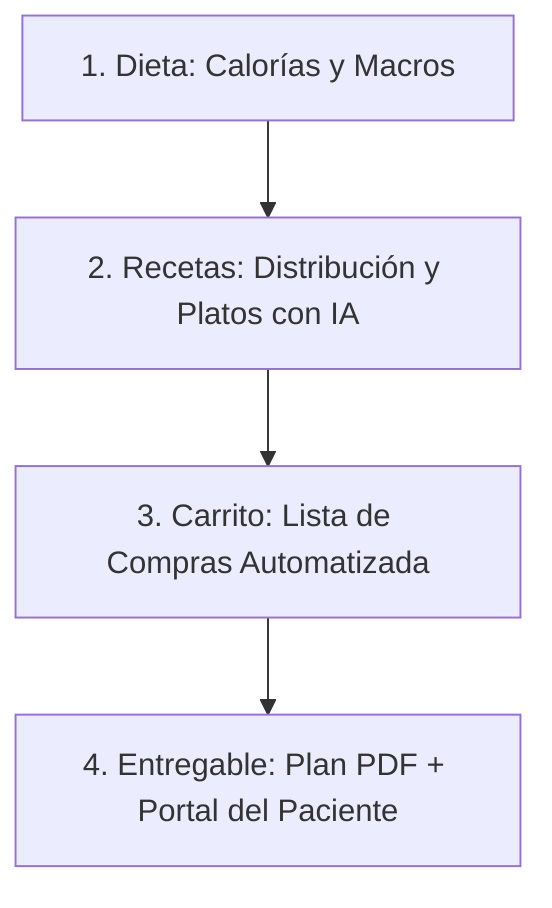

# NutriNet: Copiloto Inteligente y Ecosistema Clínico para Nutricionistas

NutriNet es una plataforma SaaS de gama premium concebida específicamente para optimizar y transformar el flujo clínico de los profesionales de la nutrición en Chile y Latinoamérica. No es simplemente un gestor de pacientes o una agenda; es un **copiloto inteligente** que combina rigor clínico, automatización matemática e Inteligencia Artificial de vanguardia para liberar al nutricionista de la carga administrativa, permitiéndole enfocarse en lo que realmente importa: el éxito y la salud de sus pacientes.

---

## 1. Propuesta de Valor y Elevator Pitch

Nuestra propuesta de valor se sostiene sobre tres pilares fundamentales que resuelven los dolores más profundos del ejercicio profesional:
*   **Ahorro Masivo de Tiempo:** Automatización del flujo clínico de extremo a extremo. Reducimos el tiempo necesario para diseñar y estructurar un plan alimentario personalizado de 45 minutos a menos de 10 minutos.
*   **Precisión y Rigor Clínico:** Eliminación del error humano en los cálculos metabólicos y de macronutrientes a través de un motor matemático adaptado a estándares internacionales (OMS, FAO) y locales (INTA Chile).
*   **Copiloto de Inteligencia Artificial Activa:** El nutricionista ya no debe escribir recetas a mano o calcular porciones de forma artesanal. La IA generativa actúa como asistente inmediato traduciendo indicaciones clínicas en platos atractivos y listos para preparar.

---

## 2. El Dolor del Mercado (El Problema del Gremio)

El día a día de un nutricionista clínico o independiente está plagado de ineficiencias operativas que limitan su capacidad de atención y disminuyen su rentabilidad:
1.  **Carga de Cálculo Manual:** El cálculo de la Tasa Metabólica Basal (TMB), Gasto Energético Total (GET), la distribución de macronutrientes y la cuadratura de porciones de intercambio consume una porción crítica de la consulta.
2.  **Desconexión de Herramientas:** Los profesionales suelen utilizar una combinación ineficiente de plantillas de Excel, documentos en Word, agendas físicas, WhatsApp y correo electrónico para gestionar la consulta, lo que dificulta el seguimiento de la evolución clínica.
3.  **Baja Adherencia del Paciente:** Los planes alimentarios entregados en formatos estáticos (como PDFs enviados por correo) se pierden con facilidad, no motivan al paciente y carecen de un canal interactivo para reportar adherencia, lo que resulta en altas tasas de abandono.
4.  **Dificultad para Personalizar Recetas:** Crear un recetario que coincida exactamente con las necesidades calóricas, restricciones alimentarias (celiaquía, alergias, veganismo) y gustos personales de cada paciente es una tarea titánica cuando se realiza manualmente.

---

## 3. La Solución NutriNet: Creada y Validada por Profesionales

NutriNet se diferencia radicalmente de los softwares de salud genéricos por su especialización extrema y su validación directa en terreno:
*   **Diseñado "Por y Para" Nutricionistas:** La plataforma ha sido testeada y optimizada en colaboración con nutricionistas chilenos en ejercicio activo, adaptándose fielmente al ritmo y orden mental de una consulta real.
*   **Localización y Rigor Chileno:** Incorpora la **Tabla de Composición de Alimentos del INTA (Universidad de Chile, 2018)** y el **Sistema Chileno de Porciones de Intercambio Equivalentes**, garantizando que los cálculos se alineen perfectamente con la formación académica nacional y la disponibilidad del mercado de alimentos chileno.
*   **Automatización de Fórmulas:** Soporte nativo para ecuaciones clínicas validadas como *Mifflin-St Jeor*, *Harris-Benedict* y *FAO/OMS*, además de la detección automática de pacientes pediátricos mediante percentiles y Z-scores de la OMS.

---

## 4. Ventajas Competitivas y Tecnología de Vanguardia (Nuestros Diferenciales)

### A. Inteligencia Artificial como Copiloto Clínico Activo
A diferencia de los softwares tradicionales que solo ofrecen una base de datos estática de recetas, NutriNet integra modelos de IA generativa para actuar como asistentes dinámicos:
*   **Generador Inteligente de Platos:** Diseña recetas únicas, variadas y atractivas ajustadas en tiempo real a los macronutrientes, calorías y porciones requeridos por el plan del paciente.
*   **Traducción de Lenguaje Natural (Recetas Rápido):** Permite al nutricionista escribir una instrucción simple (ej. *"un desayuno rápido con avena, manzana y proteína en polvo, sin lactosa y bajo en grasa"*) y la IA estructurará de inmediato el plato con sus ingredientes cuantitativos correspondientes.

### B. El Motor Clínico Secuencial en 4 Etapas
NutriNet organiza el flujo de trabajo en una tubería secuencial lógica que garantiza consistencia y velocidad:
1.  **Dieta (Planificación Estratégica):** Definición de calorías meta, distribución de macronutrientes y selección de alimentos permitidos o restringidos.
2.  **Recetas y Porciones (Cuantificación Práctica):** Distribución de las porciones del día (desayuno, almuerzo, colaciones, etc.) y generación o selección de platos asistida por la base de datos y la IA.
3.  **Carrito (Compra Automatizada):** Conversión automática de la pauta alimentaria de la semana en una lista de compras consolidada y optimizada para el paciente.
4.  **Entregable (Diseño Premium):** Generación automática de un PDF estético y profesional para el paciente, junto con la actualización automática de su Portal Interactivo.

### C. Escalabilidad y Robustez Tecnológica
*   **Arquitectura de Backend Moderno:** Construida sobre **NestJS (Modular Monolith)**, lo que permite un desarrollo desacoplado de las distintas áreas de negocio, facilitando la escalabilidad del sistema sin generar regresiones de software.
*   **Manejo de Datos Híbrido (Prisma + PostgreSQL con JSONB):** Los datos estructurados de identidad y pacientes se manejan de forma relacional, mientras que los datos flexibles de recetas, planes y respuestas de IA se almacenan en campos JSONB. Esto asegura una adaptabilidad de datos extraordinaria y rapidez en el guardado de borradores.
*   **Ciclo de Feedback Activo Integrado:** Incluye un módulo de Feedback directamente en el Dashboard. Cada nutricionista puede reportar ideas de mejora o bugs en un clic, lo que permite al equipo de desarrollo iterar con agilidad y afianzar la lealtad del usuario pionero.

---

## 5. Módulos Activos del Ecosistema

NutriNet provee una suite completa de herramientas integradas para digitalizar la práctica completa del profesional:

*   **Pacientes (CRM Clínico):** Gestión integral de fichas de pacientes, antecedentes médicos, alergias, estado fisiológico (embarazo, lactancia, etc.) e historial evolutivo.
*   **Consultas & Sesiones:** Registro cronológico de cada atención clínica para evaluar la progresión del tratamiento.
*   **Fitness & Antropometría:** Visualización gráfica de las mediciones corporales del paciente, porcentaje de grasa (calculado mediante fórmulas de pliegues), músculo e IMC.
*   **Citas & Calendario:** Agenda integrada y sincronizada bidireccionalmente con **Google Calendar**, permitiendo la reserva, modificación y confirmación de horas de consulta.
*   **Base de Conocimiento:** Bibliotecas de alimentos globales e individuales, sustitutos alimentarios y recursos educativos compartibles.
*   **Portal del Paciente:** Interfaz web interactiva donde los pacientes acceden a sus pautas dinámicas, listas de compras y registran sus progresos desde cualquier dispositivo móvil o de escritorio.

---

## 6. Mercado Objetivo, Nicho y Clientes

*   **El Nicho:** Profesionales de la Nutrición (clínicos, estéticos y deportivos) e instituciones de salud en Chile y Latinoamérica. Este nicho suele estar desatendido por grandes softwares médicos generales (como fichas clínicas generales) que carecen de herramientas de cálculo de dietas específicas.
*   **Perfil de Cliente Ideal (ICP):**
    *   **Nutricionistas Freelance / Independientes:** Que atienden de forma presencial u online y requieren optimizar su tiempo para aumentar su volumen de pacientes.
    *   **Centros Médicos y Clínicas Estéticas:** Instituciones que buscan estandarizar la entrega de planes nutricionales con un diseño premium y corporativo.
    *   **Nutricionistas de Alto Rendimiento y Gimnasios:** Enfocados en la antropometría detallada y planes adaptados a objetivos fitness de alta precisión.
*   **Potencial de Crecimiento:** Con el auge de la telemedicina y la creciente demanda por hábitos de vida saludables, los nutricionistas necesitan profesionalizar su marca personal. Un entregable impecable y un portal del paciente interactivo aumentan la retención de pacientes, convirtiendo la suscripción de NutriNet en una inversión altamente rentable para ellos.

---

## 7. Visión de Futuro y Escalabilidad del Negocio

El diseño arquitectónico y de producto de NutriNet está pensado para un crecimiento exponencial apoyado en las siguientes fases:

1.  **Consolidación del Ecosistema IA:** Evolucionar el asistente de IA no solo para crear recetas, sino para sugerir ajustes metabólicos dinámicos basados en la evolución de las métricas antropométricas del paciente de manera predictiva.
2.  **App Móvil Nativa para Pacientes:** Llevar el Portal del Paciente a una experiencia nativa en iOS y Android con notificaciones push para recordatorios de comidas, hidratación e integración con wearables.
3.  **Monetización B2B (Integración de Compras):** Conectar la lista de compras del **Carrito** con supermercados y tiendas de alimentación saludable locales, permitiendo al paciente comprar los ingredientes sugeridos en su pauta con un solo clic. Esto abre una nueva línea de ingresos por comisiones de venta (Affiliation/Retail Media).
4.  **Expansión Regional:** Exportar el modelo chileno a México, Colombia y Perú mediante la integración de las tablas de composición de alimentos locales de cada país, manteniendo el mismo core de software.

---
*NutriNet combina tecnología moderna, inteligencia artificial y el feedback diario de especialistas clínicos para liderar la transformación digital del sector de la nutrición en América Latina.*
